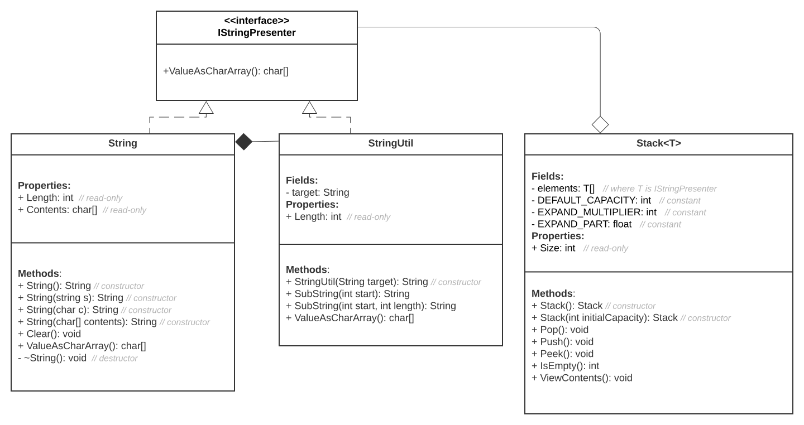

# Level 1 homework
## Домашнее задание
### Написать стек для строк
Цель: В результате выполнения ДЗ вы напишете программу с применением основ ООП (инкапсуляция, полиморфизм, наследование). В данном задании тренируются также навыки работы с динамическим распределением памяти.
1. Описать класс "Строка". Обязательные поля класса:

указатель хранит адрес динамически выделенной памяти для размещения символов строки;
отдельное значение значение хранит длину строки в байтах.
Реализовать обязательные методы следующего назначения:
-конструктор без параметров;
-конструктор, принимающий в качестве параметра строковый литерал;
-конструктор, принимающий в качестве параметра символ;
-метод получения длины строки;
-метод очистки строки (делает строку пустой);
-деструктор.

2. Написать класс работы со строками, который также может возвращать как массив символов либо всю строку либо её часть.

3. Описать стек хранения строковых данных, в котором могут использоваться объекты обоих классов. Инициализация определяет начальное число элементов, при превышении определённого процента заполнения динамически изменяется.

-инициализация стека
-помещение элемента в стек
-удаление элемента из стека
-получение верхнего элемента стека без его удаления
-определение, пуст ли стек возвращает 1 если стек пустой и 0 в противном случае.
-вывод элементов стека

4. Написать тестовый пример, который отражает:
работу каждого класса работы со строкой.
работу стека с объектами обоих классов согласно его функциональности.

## Решение
### Как запустить: открыть проект в Visual Studio, собрать, запустить.
Разработан проект на языке C#, состоящий из двух подпроектов: само решение (проект **CustomString**) и юнит тесты (проект **UnitTests**). 
Основные сущности: интерфейс IStringPresenter, классы String.cs, StringUtil.cs, Stack.cs

